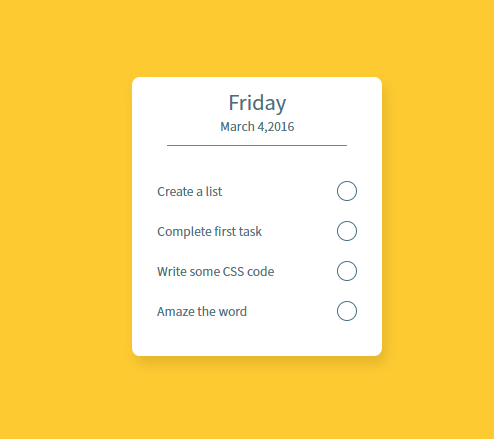
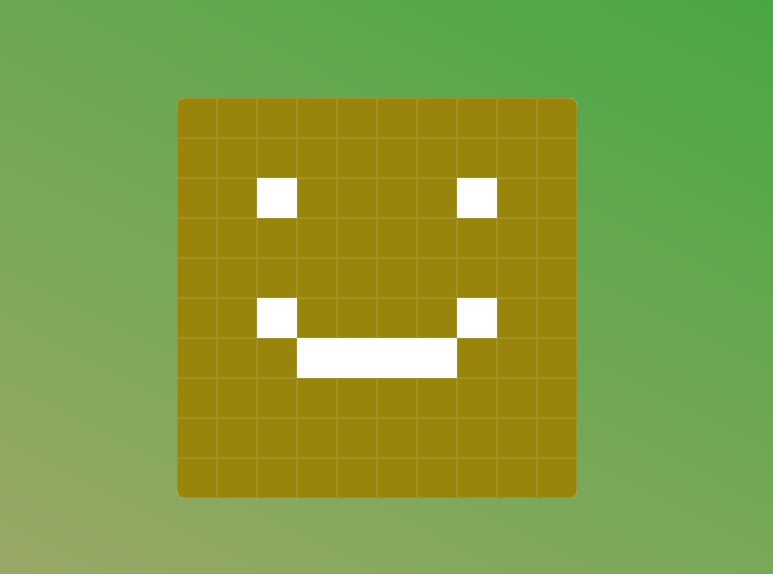
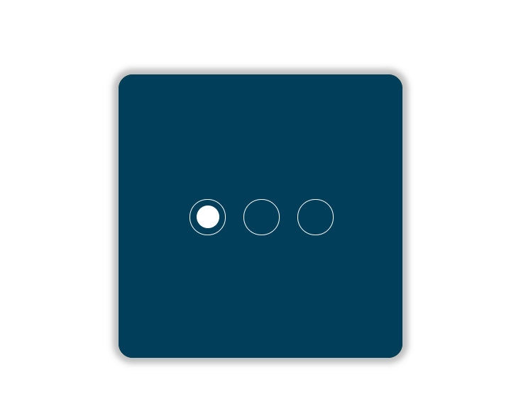
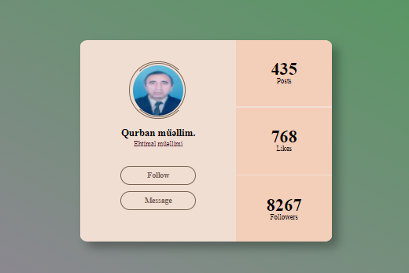
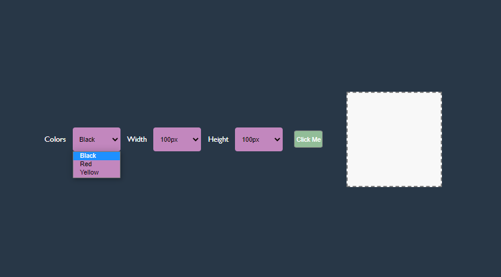
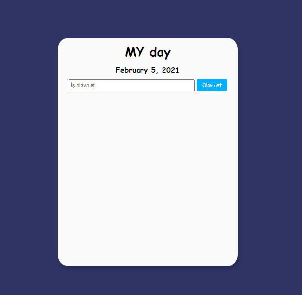
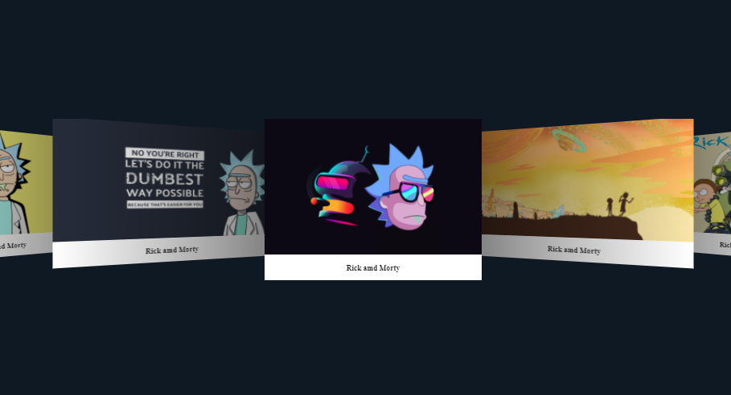

# Challenges!

Different and interesting challenges in **Css** and **JavaScript**

 

# CSS

# Day 1 - [Todo with only CSS](https://github.com/cavid-aliyev/Challanges/tree/master/ChallangeDAY01)

# Day 2 - [Mini animated slider](https://github.com/cavid-aliyev/Challanges/tree/master/ChallangeDAY02)

# Day 3 - [Sapper](https://github.com/cavid-aliyev/Challanges/tree/master/ChallangeDAY03)

# Day 4 - [Interactive slider](https://github.com/cavid-aliyev/Challanges/tree/master/ChallangeDAY04)

# Day 5 - [User Avatar](https://github.com/cavid-aliyev/Challanges/tree/master/ChallangeDAY05)

# JavaScript

# Day 1 - [Selections](https://github.com/cavid-aliyev/Challanges/tree/master/JSChallangeDAY01)

# Day 2 - [Todo with JS](https://github.com/cavid-aliyev/Challanges/tree/master/JSChallangeDAY02)

# Day 3 - [3d Slider witj Swiper lib](https://github.com/cavid-aliyev/Challanges/tree/master/JSChallangeDAY03)

